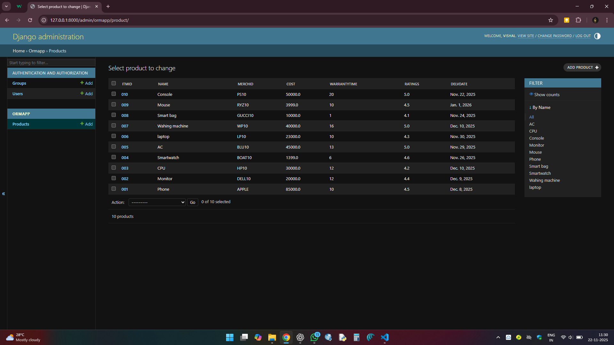

# Ex01 Django ORM Web Application
## Date: 22-11-2025

## AIM
To develop a Django Application to store and retrieve data from a E-Commerce Website Database for Amazon or Flipkart using Object Relational Mapping(ORM).

## ENTITY RELATIONSHIP DIAGRAM


## DESIGN STEPS

### STEP 1:
Clone the problem from GitHub

### STEP 2:
Create a new app in Django project

### STEP 3:
Enter the code for admin.py and models.py

### STEP 4:
Detect changes and create migration files that describe how to modify the database schema

### STEP 5:
Execute the migration files and update the database schema to match your Django models

### STEP 6:
Create a superuser with full access rights to all models and data through the admin interface.

### STEP 7:
Apply the migration files of the created app to the database

### STEP 8:
Execute Django admin using localhost and create details for 10 entries

## PROGRAM
```
models.py:
from django.db import models
from django.contrib import admin
class Product(models.Model):
    ItmID=models.CharField(primary_key=True,max_length=7)
    Name=models.CharField(max_length=30)
    MerchID=models.CharField(max_length=7)
    Cost=models.FloatField()
    WarrantyTime=models.IntegerField()
    Ratings=models.FloatField()
    DelvDate=models.DateField()

class ProductAdmin(admin.ModelAdmin):
    list_display=["ItmID","Name","MerchID","Cost","WarrantyTime","Ratings","DelvDate"]
    actions_on_bottom=True
    actions_on_top=False
    list_display_links=["ItmID"]
    list_filter=["Name"]

admin.py:
from django.contrib import admin
from.models import Product,ProductAdmin
admin.site.register(Product,ProductAdmin)
```


## OUTPUT



## RESULT
Thus the program for creating E-commerce website database using ORM hass been executed successfully
